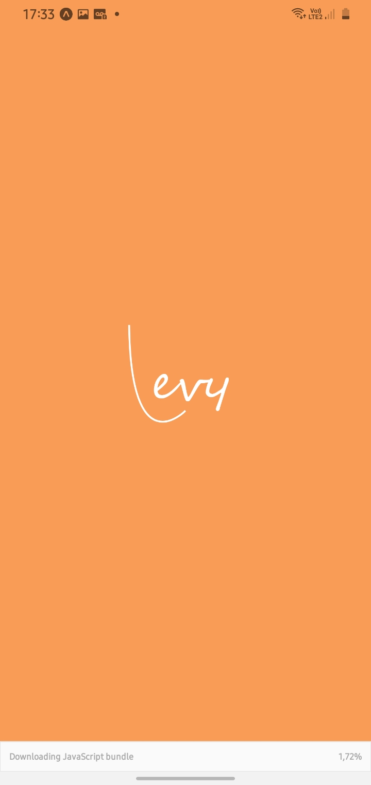
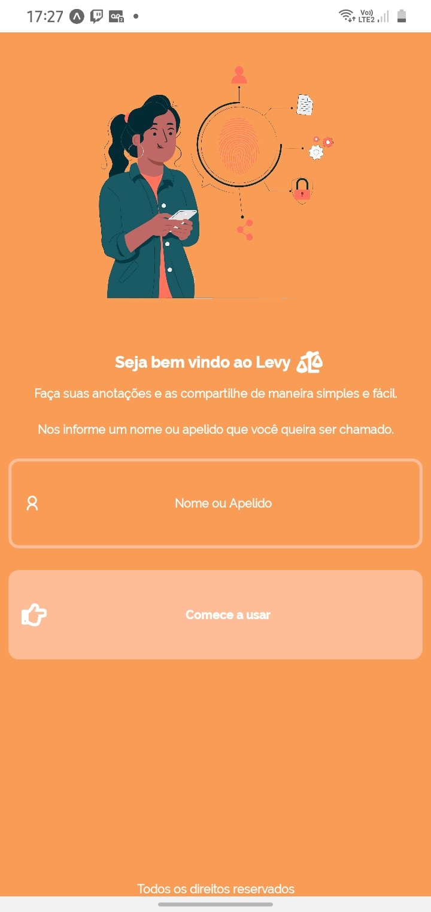
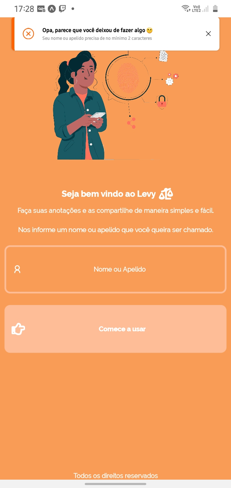
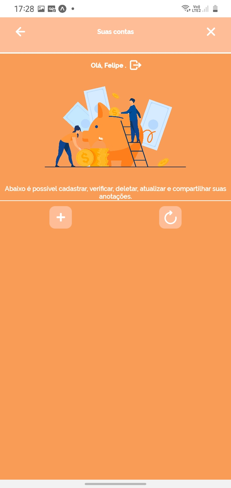
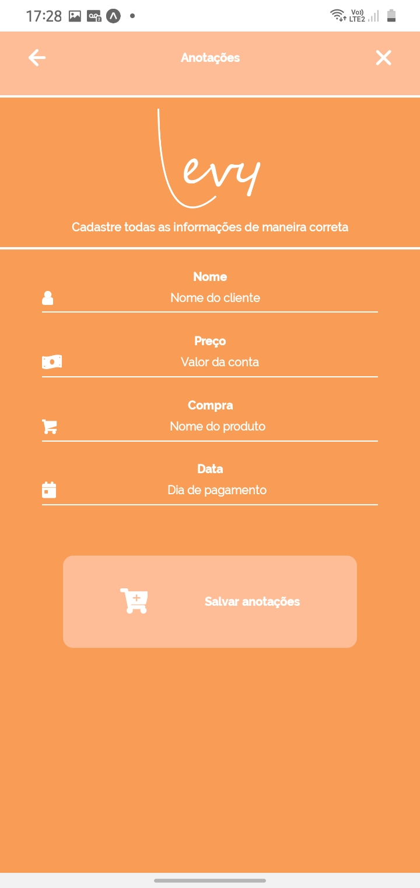
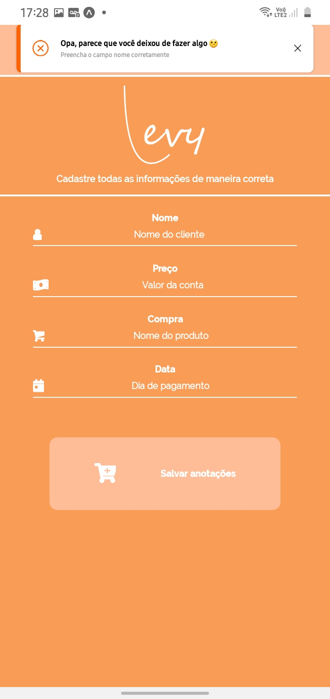
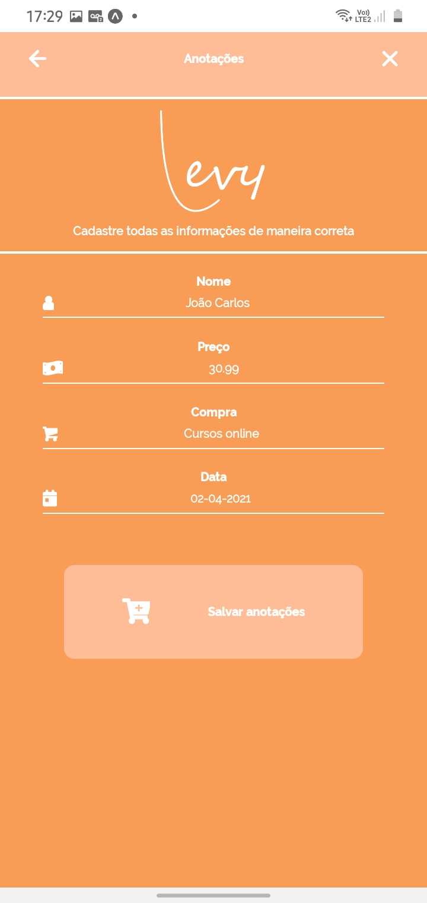
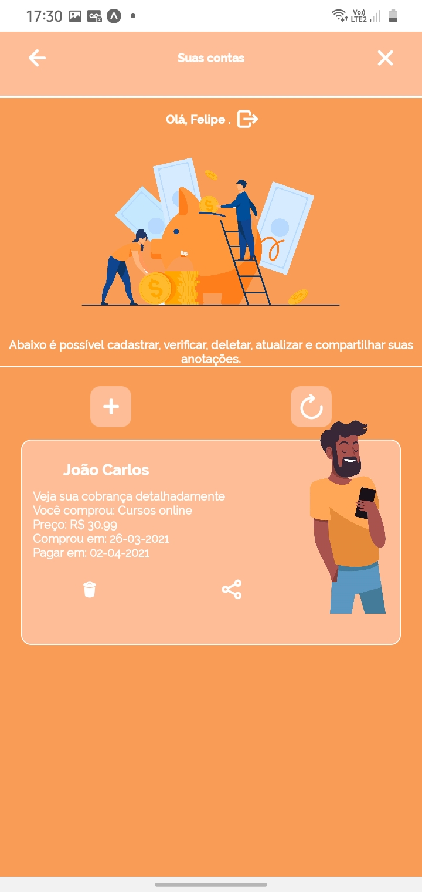

<h3 align="center">O aplicativo que organiza suas cobranças de maneira simples e eficaz! 📱

<h4 align="center">Splash screen do aplicativo. A primeira impressão do aplicativo será esta!</h4>

<h4 align="center">Após a inicialização do aplicativo, teremos uma tela para que o usuário possa cadastrar seu nome ou apelido. Lembrando que essa informação é salva no AsyncStore. </h4>

<h4 align="center">Ainda sobre a tela de cadastro é necessário que o usuário informe um nome. Caso usuário não informe será mostrado uma mensagem de erro na parte superior informando o que mesmo pode e deve fazer para prosseguir com uso do aplicativo</h4>

<h4 align="center">Essa é a tela home do aplicativo. É nela que iremos exibir todas as cobranças que temos registradas.</h4>

<h4 align="center">Podemos ver na parte superior da tela home o nome que foi informado no cadastro do aplicativo. Ao lado também é possível fazer o logout da conta cadastrada.

<h4 align="center">Essa é a tela aonde iremos cadastrar todas as informações sobre as nossas cobranças. Lembrando que é necessário que todos os campos sejam preenchidos corretamente. Caso contrário, na parte superior do aplicativo, será mostrado uma mensagem de erro orientando o usuário sobre o que fazer.</h4>

<h4 align="center">Caso algum campo não seja informado</h4>

<h4 align="center">Se tudo for informado da maneira correta, a cobrança será cadastrada e o aplicativo irá lhe direcionar para tela home<h4>

<h4 align="center">Vale lembrar que através da tela home é possível compartilhar todas as informações sobre a cobrança. Também é possível remover a cobrança caso ela já tenha sido normalizada.</h4>

<h2 align="center">Aplicativo concluído 🚀</h2>

<h2 align="center">Tecnologias utilizadas</h2>

React Native 🔩

NodeJS 🔩

Expo 🔩

<h1 align="center">Desenvolvido por Felipe Costa 🤌🏿</h1>